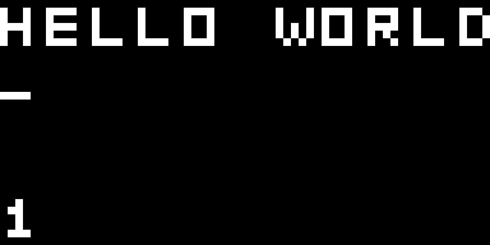

## Screenshots


_text editor_


## Requirements

* SDL2
* GNU Make

## Download and Build

```console
git clone https://github.com/Myth512/chip-8
cd chip-8
make build
```

## Run

```console
make run
```

or

```console
./bin/chip8 "path to ROM"

```

## Improvements

* Add sound
* Enhance UI
* Add color themes
* Fix flickering
* Add settings
