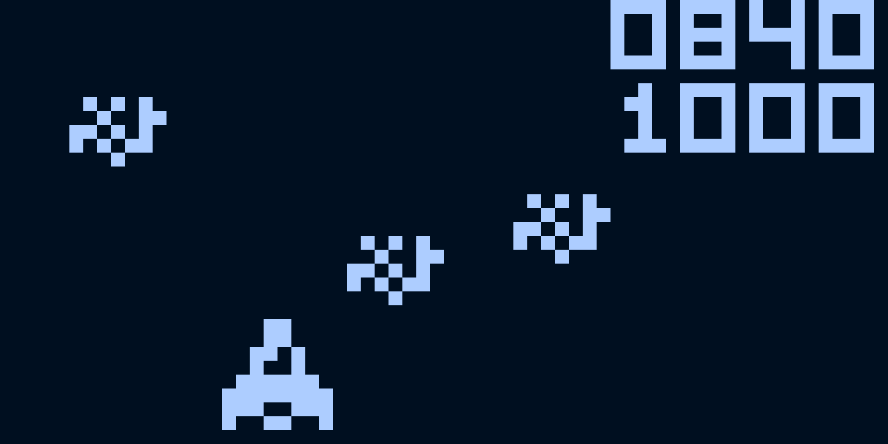

## Screenshots


_Astro Dodge_

_Pong_

## Requirements

* SDL2
* GNU Make

## Download and Build

```console
git clone https://github.com/Myth512/chip-8
cd chip-8
make build
```

## Run

```console
make run
```

or

```console
./bin/chip8 "path to ROM"

```

## Settings

Currently only way to change settings is to change macros in /include/constants.h and recompile project.

* To change resolution adjust SCALE, new resolution is 64*SCALE x 32*SCALE.
* There are 5 color themes, to change just define one of them.


## Improvements

* Add sound
* Enhance UI
* Fix flickering
* Add normal settings
